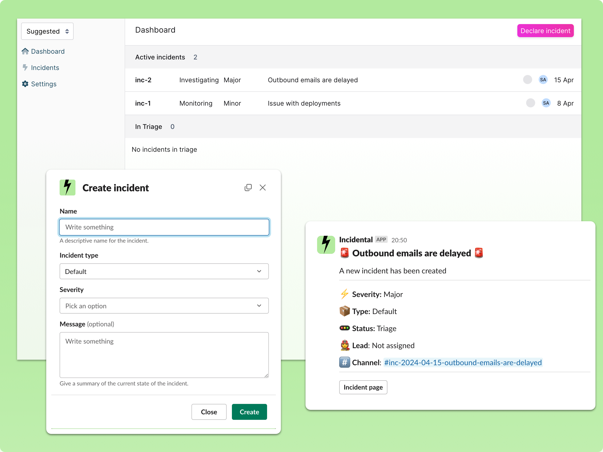

<br/>

> Incidental is still in its early stage of development, so there may be some teething problems along the way. Please let us know of any suggestions, bugs, ideas, etc using Github issues. We'll use your feedback to improve
>
> ⚡ **Sign up to the hosted version of Incidental here - https://incidental.dev** ⚡

<br/>


# Incidental is an open-source incident management platform

Incidental is an open-source incident management platform designed to streamline your incident response process. It provides a centralized hub for declaring, managing, and resolving incidents efficiently within your organization.



## Features

We're building Incidental to be a best-in-class platform for managing your incidents. Here's what we offer:

- ✅ **ChatOps:** Declare and manage your incidents all within your Slack workspace
- ✅ **Web UI:** Easy-to-use web interface to manage your incidents
- ✅ **Custom Severities:** Define severity levels that match your organization's needs
- ✅ **Custom Fields:** Add and track incident-specific data points
- ✅ **Custom Incident Types:** Categorize incidents according to your operational model
- ✅ **Custom Roles:** Define roles and responsibilities for your incident response team
- ✅ **Status Pages:** Display the current status of your incidents to your stakeholders with customizable status pages
- 🚧 **Custom Workflows:** (Coming Soon) Automate your incident response processes

## Quick start

This guide will help you set up Incidental for local development.

### Requirements:

- docker
- docker-compose
- pnpm
- node v18

### Setup Steps:

1. **Create a new Slack application**

   - Go to: https://api.slack.com/apps, and use the `slack-manifest.yml` as a template to create the app.
   - Replace `BACKEND_BASE_URL` with the URL where you're hosting the backend
   - Replace `FRONTEND_BASE_URL` with the URL where you're hosting the frontend

2. **Set up environment variables**

   - Copy `backend/.env.example` to `backend/.env` and update the Slack-specific environment variables
   - Copy `frontend/.env.example` to `frontend/.env`

3. **Start the backend**

   - In the `backend` directory, run:

     ```bash
     make run-dev
     ```

   - This will run the backend at http://localhost:5000

4. **Start the frontend**

   - In the `frontend` directory, run:

     ```bash
     make run-dev
     ```

   - This will run the frontend at http://localhost:3000

5. **Create a new account**

   - Go to http://localhost:3000 and create a new account

# Resources

- [Website](https://incidental.dev)
- If you have any questions, you can email [hello@incidental.dev](mailto:hello@incidental.dev)

## Contributing

We welcome contributions to Incidental! Here's how you can help:

1. Fork the repository
2. Create a new branch (`git checkout -b feature/AmazingFeature`)
3. Make your changes
4. Commit your changes (`git commit -m 'Add some AmazingFeature'`)
5. Push to the branch (`git push origin feature/AmazingFeature`)
6. Open a Pull Request

## Roadmap

- [ ] Implement custom workflows
- [ ] Add integration with popular monitoring tools
- [ ] Enhance reporting and analytics features

## License

This project is licensed under the MIT License - see the [LICENSE](LICENSE) file for details.
